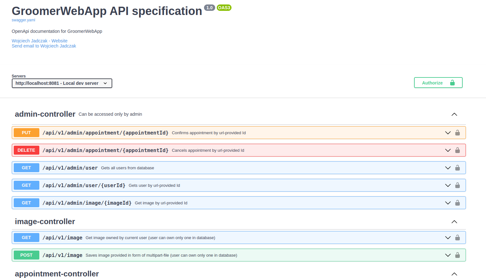

<!DOCTYPE html>
<html lang="en">
<head>
    <meta charset="UTF-8">
    <meta name="viewport" content="width=device-width, initial-scale=1.0">
</head>
<body>

<h1>Groomer Web Application</h1>

The Groomer Web Application is a booking web application dedicated to groomers. It provides a backend of platform for groomers to manage appointments and bookings efficiently.

<h2>Table of Contents</h2>

<ul>
    <li><a href="#features">Features</a></li>
    <li><a href="#technologies-used">Technologies Used</a></li>
    <li><a href="#getting-started">Getting Started</a></li>
    <li><a href="#usage">Usage</a></li>
    <li><a href="#contributing">Contributing</a></li>
    <li><a href="#documentation">API Documentation</a></li>
</ul>

<h2 id="features">Features</h2>

<ul>
    <li>Allows to manage appointments and bookings</li>
    <li>Provides secure authentication and authorization mechanisms</li>
    <li>Integrates with PostgreSQL database</li>
    <li>Implements admin management</li>
    <li>Incorporates Flyway for database migrations</li>
</ul>

<h2 id="technologies-used">Technologies Used</h2>

<ul>
    <li>Spring Boot 3.1.0-RC1</li>
    <li>Java 17</li>
    <li>Hibernate</li>
    <li>Maven</li>
    <li>PostgreSQL</li>
    <li>Spring Security</li>
    <li>Springdoc OpenAPI</li>
    <li>Flyway</li>
    <li>Mapstruct</li>
    <li>Lombok</li>
    <li>Jasypt</li>
    <li>Docker</li>
</ul>

<h2 id="getting-started">Getting Started</h2>

To get started with the Groomer Web Application, follow these steps:

<ol>
    <li>Clone the repository:</li>
</ol>

<pre><code>git clone https://github.com/your-username/groomerWebApp.git
cd groomerWebApp
</code></pre>

<ol start="2">
    <li>Build the project:</li>
</ol>

<pre><code>mvn clean install
</code></pre>

<ol start="3">
    <li>Run the application:</li>
</ol>

<pre><code>mvn spring-boot:run
</code></pre>

<h2 id="usage">Usage</h2>

Once the application is running, you can access it at <code>http://localhost:8081</code>. Use the provided endpoints to manage appointments and bookings.

<h2 id="contributing">Contributing</h2>

Contributions to the Groomer Web Application are welcome! If you find any issues or have suggestions for improvements, please open an issue or submit a pull request.

<h2 id="documentation">API Documentation</h2>

Swagger API documentation available at github pages:

</body>
</html>

